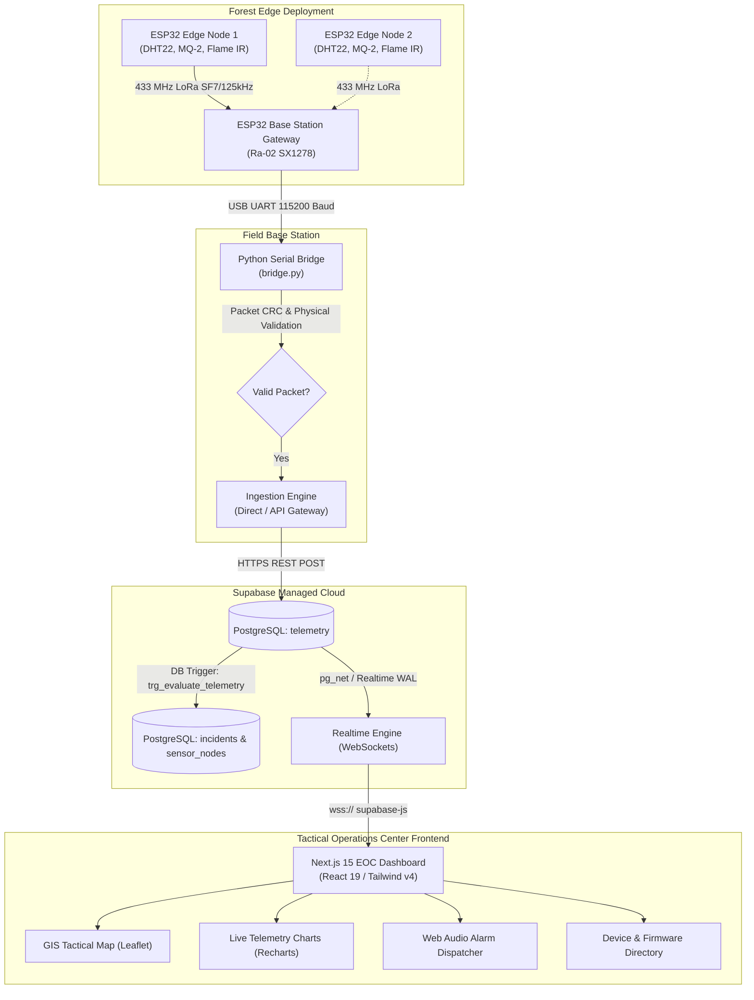

# Project Overview: Wildfire Operations Center (EOC) IoT & Telemetry Platform

## 1. Project Title & Identification
* **Official Project Title:** Edge-to-Cloud IoT Early Wildfire Detection and Tactical Operations Center Platform
* **Academic Level:** B.Tech Final Year Capstone Project (Computer Science / Information Technology / Electronics & Communication Engineering)
* **Domain:** Internet of Things (IoT), Embedded Systems, Real-Time Cloud Systems, Tactical GIS Operations & Emergency Response Management

---

## 2. Executive Summary & Problem Statement

### 2.1 The Real-World Problem
Wildfires and forest fires cause catastrophic environmental, economic, and human loss worldwide. Traditional forest fire detection systems suffer from critical operational bottlenecks:
1. **Satellite Remote Sensing Latency:** Satellites (e.g., MODIS, VIIRS) offer broad coverage but suffer from 3 to 12-hour orbital revisit intervals, cloud cover obscuration, and inability to detect small smoldering ground-level fires before they escalate into canopy crowns.
2. **Thermal Camera Towers:** Optical and infrared lookout towers require line-of-sight across complex topography, are susceptible to heavy mountain haze/fog, and require high capital expenditure and grid power.
3. **Lack of Forest Canopy Connectivity:** Deep forest canopies lack cellular (GSM/4G/5G) or Wi-Fi coverage due to high attenuation, remote terrain, and lack of terrestrial cell towers.
4. **Delayed First Responder Dispatch:** Even when smoke is sighted visually, emergency response coordinators lack real-time localized environmental data (ambient temperature, localized humidity, smoke particulate levels, RF signal strength, exact GPS coordinates) to assess fire progression velocity and deploy firefighting assets safely.

### 2.2 The Proposed & Implemented Solution
This project implements a complete, end-to-end **Edge-to-Cloud Wildfire Early Detection and Tactical Emergency Operations Center (EOC)**:
1. **Autonomous Edge Sensor Nodes:** Deployed in forest zones, combining an **ESP32 DevKit V1** microcontroller with multi-modal sensors (DHT22 for temperature/humidity, MQ-2 for combustible gas/smoke ADC, and Optical Infrared Photodiode for flame detection).
2. **Long-Range Sub-GHz RF Telemetry (LoRa 433 MHz):** An **Ai-Thinker Ra-02 (SX1278)** transceiver broadcasts sensor telemetry over 433 MHz chirp spread spectrum radio, capable of penetrating dense foliage and overcoming line-of-sight obstructions without cellular infrastructure.
3. **Base Station Gateway & Hardware Serial Bridge:** A listening gateway receives RF packets, logs Physical Layer Signal Quality (RSSI in dBm, SNR in dB), and forwards framed data over USB UART (115200 baud) to a rugged Python Serial Bridge (`bridge.py`). The bridge executes strict physical boundary validation and securely ingests telemetry into a cloud database.
4. **Cloud Database & Serverless Reactive Backend:** Hosted on **Supabase (PostgreSQL 15)** with database-level triggers (`trg_evaluate_telemetry`) that automatically evaluate fire threat conditions, manage node operational statuses, and debounce incident alarms in real time.
5. **Real-Time Tactical EOC Workstation:** A **Next.js 15 (React 19, TypeScript, Tailwind CSS v4)** workstation providing sub-second GIS tactical mapping (Leaflet), interactive multi-sensor time-series visualizers (Recharts), acoustic alarm dispatching (Web Audio API synth), and full device/firmware lifecycle management.

---

## 3. Project Objectives
* **Sub-Second Threat Identification:** Detect rapid temperature surges, ambient humidity drops, elevated smoke density, and active infrared radiation at the edge within 2000 milliseconds of occurrence.
* **Infrastructure-Free Rural Communication:** Maintain reliable telemetry transmission across non-line-of-sight wilderness using 433 MHz LoRa modulation.
* **Dual Ingestion Architecture:** Support high-performance direct database ingestion (`SUPABASE_DIRECT`) alongside enterprise authenticated HTTP API Gateway ingestion (`API_GATEWAY`).
* **Zero-Poll Reactive Operations UI:** Deliver sub-second telemetry and incident streaming to emergency dispatch operators via PostgreSQL Write-Ahead Log (WAL) WebSocket replication without polling.
* **Field Proven Resilience:** Provide offline UART buffering, automatic serial reconnection with exponential backoff, CRC payload verification, and duplicate packet suppression at the edge and cloud.

---

## 4. System Architecture & Workflow

---

## 5. Major System Modules

| Module Name | File Location | Primary Technologies | Core Responsibilities |
| :--- | :--- | :--- | :--- |
| **Edge Sensor Node** | `firmware/sensor_node/sensor_node.ino` | C++, Arduino ESP32 core, `LoRa.h`, `DHT.h` | Multi-sensor acquisition (DHT22, MQ-2, Flame IR), JSON telemetry payload serialization, 433 MHz LoRa RF packet transmission every 2s. |
| **Base Station Gateway** | `firmware/gateway/gateway.ino` | C++, Arduino ESP32 core, `LoRa.h` | 433 MHz LoRa packet demodulation, RSSI and SNR signal quality metric extraction, UART framing (`GATEWAY_PACKET:` prefix). |
| **Hardware Serial Bridge** | `bridge/bridge.py` | Python 3.10+, `pyserial`, `requests`, `python-dotenv` | USB COM port auto-discovery, UART string framing, physical boundary validation, dual-mode cloud forwarding (`SUPABASE_DIRECT` / `API_GATEWAY`), exponential backoff retry. |
| **Cloud Database & Logic** | `lib/schema.sql` | PostgreSQL 15, PL/pgSQL, Supabase Realtime | Schema definition (`gateways`, `sensor_nodes`, `telemetry`, `incidents`), composite foreign keys, trigger-based fire incident evaluation, duplicate deduplication. |
| **EOC Workstation UI** | `app/`, `components/`, `lib/` | Next.js 15.4 (App Router), React 19, TypeScript, Tailwind CSS v4, Lucide Icons | Responsive 100dvh operator dashboard with 3 primary workspaces: Operations (GIS Map + Incident Rail), Telemetry (Recharts charts + raw ingest log), and System (Device manager + Schema viewer). |
| **Realtime Sync Engine** | `lib/hooks/useRealtimeDashboard.ts` | Supabase Realtime Client, React Custom Hooks | Channel subscriptions to `postgres_changes` across `telemetry`, `incidents`, `sensor_nodes`, and `gateways`, state caching, connection health tracking. |
| **Synthesized Audio Alarm** | `lib/audio.ts` | Web Audio API (`AudioContext`) | Browser-native dual-tone pulsating siren synthesizer (880 Hz / 440 Hz square waves) triggered on critical wildfire incidents without external audio files. |

---

## 6. Technology Stack Summary

* **Hardware & Embedded:** ESP32 DevKit V1 (Xtensa dual-core 32-bit LX6 @ 240MHz), Semtech SX1278 (Ai-Thinker Ra-02 433MHz LoRa), Aosong DHT22/AM2302 capacitive humidity/temperature sensor, MQ-2 tin-dioxide semiconductor gas sensor, Optical Infrared photodiode flame sensor.
* **Bridge & Middleware:** Python 3.12, PySerial, Requests, Python-Dotenv, Unittest.
* **Cloud Database & Backend:** Supabase PostgreSQL 15, Row Level Security (RLS), PL/pgSQL Triggers, Supabase Realtime (WebSocket CDC engine).
* **Frontend Web Application:** Next.js 15.4.9, React 19.1.0, TypeScript 5, Tailwind CSS v4, Leaflet 1.9.4 & React-Leaflet 5.0.0, Recharts 2.15.4, Lucide-React, Web Audio API.
* **Tooling & Test Suites:** Bun runtime/test runner (37 passing UI/API unit tests), Python `unittest` (30 passing bridge unit tests), Git, Vercel Serverless Hosting.

---

## 7. Current Project Limitations & Future Scope

### 7.1 Implemented & Verified Capabilities
- [x] End-to-end hardware sensor reading, LoRa 433 MHz wireless broadcasting, and USB gateway forwarding.
- [x] Python hardware bridge with auto-reconnect, physical range validation, and direct Supabase database insertion.
- [x] Automated PL/pgSQL trigger-based incident creation and node status transitions (`ONLINE` $\to$ `ALERT`).
- [x] Live GIS map displaying node markers with status-dependent pulsing rings, custom tactical styling, and sensor popups.
- [x] Multi-metric historical and live time-series charting with zoom, metric toggling, and data export (CSV/JSON).
- [x] Zero-dependency Web Audio API alarm sound generator with operator mute controls.
- [x] Complete device directory, hardware pinout viewer, and interactive SQL schema inspector.

### 7.2 Explicit System Limitations
* **Mesh Routing (Single-Hop Star Topology):** Current RF firmware implements a star network (Nodes $\to$ Single Gateway). True multi-hop packet forwarding across intermediate nodes is documented in concept (`docs/SWARMING_MESH_CONCEPT.md`) but not flashed in the active Arduino firmware.
* **GPS Hardware Integration:** Nodes use fixed coordinates configured during gateway/node registration in the database rather than onboard GPS NEO-6M hardware modules to conserve power and reduce BOM cost.
* **Unauthenticated Dashboard View:** The web frontend does not enforce operator login/passwords; access control relies on Supabase anon/service-role API keys and pre-shared bridge bearer tokens.

### 7.3 Future Scope
* Implementation of solar power harvesting with LiFePO4 battery charge management and deep-sleep cycling.
* LoRaWAN / TTN (The Things Network) compliance and multi-hop mesh routing using ESP-MESH or Reticulum.
* AI/ML edge anomaly detection (TinyML on ESP32) to compute localized Fire Weather Index (FWI) dynamically.
* Role-based access control (RBAC) with Supabase Auth for dispatchers, field rangers, and administrators.
