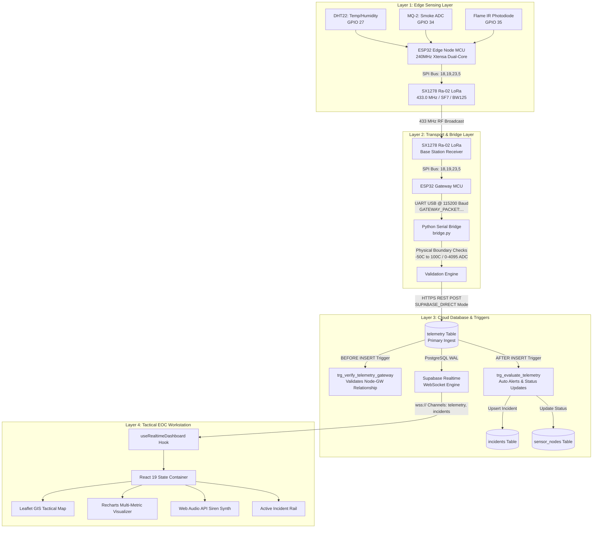
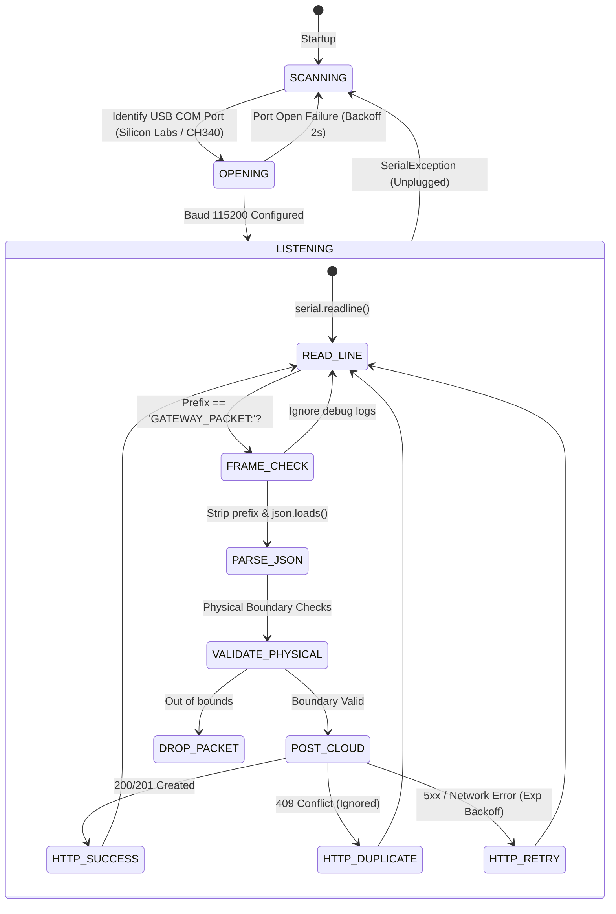
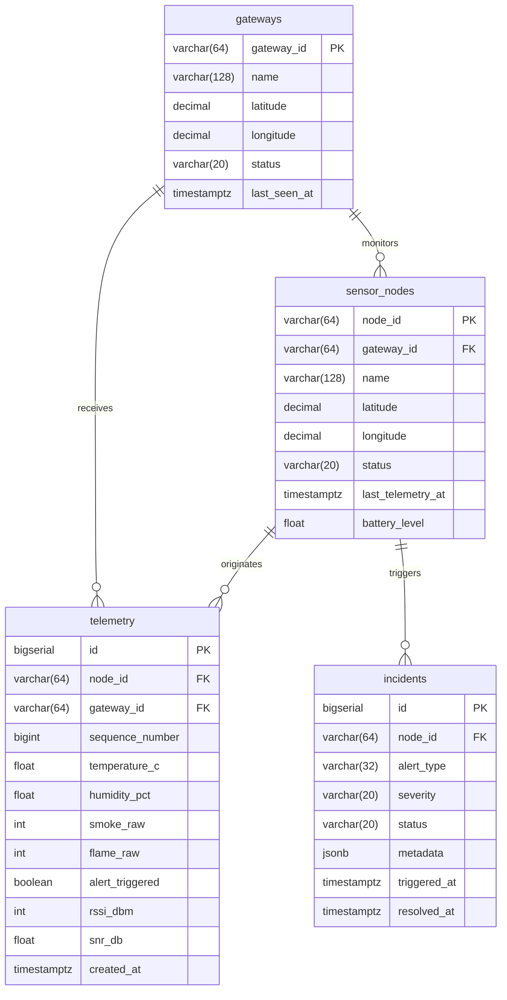

# Technical Documentation & Architecture Manual

## 1. System Architecture Overview

The Wildfire Operations Center (EOC) platform is engineered as a decoupled, multi-tier Edge-to-Cloud telemetry and situational awareness system. It consists of four distinct operational layers:
1. **Edge Sensing Layer:** ESP32 microcontrollers polling physical transducers and modulating RF data.
2. **Sub-GHz RF & Ingestion Layer:** 433 MHz LoRa transceiver base stations coupled with a host-level Python hardware bridge.
3. **Cloud Database & Reactive Rules Engine:** Supabase PostgreSQL 15 instance executing stored procedures, database triggers, and change-data-capture (CDC) streaming.
4. **Presentation & Command Layer:** Next.js 15 single-page tactical operations workstation.



---

## 2. Hardware & Embedded Firmware Architecture

### 2.1 Sensor Node Hardware Specifications & Pinout (`firmware/sensor_node/sensor_node.ino`)
The edge node operates on an **ESP32 DevKit V1 (30-pin)** board. Sensors sample the ambient environment every 2000 milliseconds:
* **DHT22 (AM2302) Temperature & Humidity Sensor:**
  * Power: 3.3V / GND
  * Signal Pin: **GPIO 27** (Digital bidirectional single-bus with internal 10k pull-up).
  * Measurement Range: $-40^\circ\text{C}$ to $+80^\circ\text{C}$ ($\pm 0.5^\circ\text{C}$ accuracy), $0\text{--}100\%$ RH ($\pm 2\%$ accuracy).
* **MQ-2 Smoke & Combustible Gas Sensor:**
  * Heater Power: 5.0V (VBUS / External rail), GND.
  * Analog Output Pin: **GPIO 34** (Input-only ADC1 channel 6).
  * Conversion: 12-bit Successive Approximation Register (SAR) ADC ($0\text{--}4095$ range).
* **Optical Infrared Flame Sensor:**
  * Power: 3.3V / GND.
  * Analog Photodiode Output: **GPIO 35** (Input-only ADC1 channel 7).
  * Characteristics: Inverted analog logic ($4095$ represents ambient dark infrared; values drop towards $0\text{--}500$ upon detecting direct 760nm–1100nm infrared hydrocarbon flame radiation).
* **Ai-Thinker Ra-02 (Semtech SX1278) LoRa Radio Module:**
  * Interface: Hardware SPI (Standard VSPI pins).
  * Chip Select (`NSS`): **GPIO 5**
  * Reset (`RST`): **GPIO 14**
  * Interrupt (`DIO0`): **GPIO 26**
  * Clock (`SCK`): **GPIO 18**
  * Master In Slave Out (`MISO`): **GPIO 19**
  * Master Out Slave In (`MOSI`): **GPIO 23**

```
+-------------------------------------------------------------+
|                     ESP32 DEVKIT V1                         |
|                                                             |
|   [GPIO 27] <---- Data ----- [DHT22 Temp & Humidity Sensor] |
|   [GPIO 34] <---- Analog --- [MQ-2 Gas & Smoke Sensor (5V)] |
|   [GPIO 35] <---- Analog --- [Optical Flame Photodiode]     |
|                                                             |
|   [GPIO  5] ---- NSS -----\                                 |
|   [GPIO 14] ---- RST ------\                                |
|   [GPIO 26] <--- DIO0 -----\  [Ai-Thinker Ra-02 SX1278]     |
|   [GPIO 18] ---- SCK ------/  (433.0 MHz LoRa Module)       |
|   [GPIO 19] <--- MISO ----/                                 |
|   [GPIO 23] ---- MOSI ---/                                  |
+-------------------------------------------------------------+
```

### 2.2 RF Modulation Parameters
* **Carrier Frequency:** `433.0 MHz`
* **Bandwidth (BW):** `125 kHz`
* **Spreading Factor (SF):** `7` (Configured for high data rate and low latency within canopy bounds; expandable up to SF12 for multi-kilometer line of sight).
* **Coding Rate (CR):** `4/5`
* **Sync Word:** `0x12` (Default private network sync word).
* **Preamble Length:** `8 symbols`
* **CRC:** Hardware CRC enabled on all packets.

### 2.3 Edge Packet Formatting
The edge node formats readings into a compact JSON object broadcasted over LoRa:
```json
{
  "node_id": "NODE-DEMO-01",
  "seq": 1024,
  "temp": 28.6,
  "hum": 72.3,
  "smoke": 1781,
  "flame": 4095,
  "alert": false
}
```

### 2.4 Base Station Gateway Firmware (`firmware/gateway/gateway.ino`)
The base station listens continuously for incoming LoRa packets. When a packet passes hardware CRC:
1. It reads the raw RF payload from the SX1278 FIFO buffer.
2. It queries the SX1278 internal registers for Physical Layer metrics:
   * **RSSI (Received Signal Strength Indicator):** Value in dBm (e.g., `-88 dBm`).
   * **SNR (Signal-to-Noise Ratio):** Value in dB (e.g., `+7.5 dB`).
3. It packages the raw JSON string with the physical metrics and outputs a framed string over USB UART at **115200 baud**:
```
GATEWAY_PACKET:{"gw_id":"GW-DEMO-01","rssi":-88,"snr":7.5,"payload":{"node_id":"NODE-DEMO-01","seq":1024,"temp":28.6,"hum":72.3,"smoke":1781,"flame":4095,"alert":false}}
```

---

## 3. Hardware Serial Bridge Architecture (`bridge/bridge.py`)

The bridge is a resilient Python 3 daemon designed to bridge physical UART serial data into cloud web infrastructure.



### 3.1 Validation Engine Boundaries
To prevent garbled memory, cosmic rays, or floating ADC pins from poisoning cloud analytics, `bridge.py` validates every field against hard physical boundaries before transmission:
* Temperature: $-50.0^\circ\text{C} \le T \le +100.0^\circ\text{C}$
* Humidity: $0.0\% \le H \le 100.0\%$
* Smoke ADC: $0 \le \text{ADC} \le 4095$
* Flame ADC: $0 \le \text{ADC} \le 4095$
* RSSI: $-150 \le \text{RSSI} \le 0\text{ dBm}$
* SNR: $-30.0 \le \text{SNR} \le +30.0\text{ dB}$

### 3.2 Ingestion Modes
1. **`SUPABASE_DIRECT` (Default Production Mode):**
   * Transmits directly to `https://<supabase_id>.supabase.co/rest/v1/telemetry`.
   * Authenticates using the Supabase Service Role Key (`apikey` and `Authorization: Bearer` headers).
   * Benefits: Zero intermediary API latency, sub-50ms cloud ingest times.
2. **`API_GATEWAY` Mode:**
   * Transmits to Next.js API route `POST http://localhost:3000/api/telemetry`.
   * Authenticates using a pre-shared bearer token (`TELEMETRY_INGEST_KEY`).

---

## 4. Cloud Database & Backend Stored Procedures (`lib/schema.sql`)

The database is built on PostgreSQL 15 and leverages native relational constraints and PL/pgSQL triggers to handle edge ingestion logic inside the database engine.



### 4.1 Database Trigger Logic

#### A. Gateway-Node Association Trigger (`trg_verify_telemetry_gateway`)
Before any telemetry row is committed, this `BEFORE INSERT` trigger ensures that the `gateway_id` transmitting the telemetry is valid and updates the gateway's `last_seen_at` timestamp.

#### B. Automated Incident Evaluation Trigger (`trg_evaluate_telemetry`)
This `AFTER INSERT` trigger is the core autonomic alert engine:
1. **Status Evaluation:**
   * If `flame_raw < 100` (Infrared flame detected) OR `smoke_raw > 2000` (Dense smoke detected), the node is flagged in emergency condition.
   * If emergency condition is true, `sensor_nodes.status` is updated to `'ALERT'`.
   * If values return to normal ($T < 45^\circ\text{C}$, $\text{Smoke} \le 1500$, $\text{Flame} \ge 1000$), status transitions back to `'ONLINE'`.
2. **Incident Debouncing:**
   * Checks for any existing `'ACTIVE'` incident on the same `node_id`.
   * If no active incident exists, it inserts a new incident record with severity `'CRITICAL'`, capturing the trigger metrics in `metadata`.
   * If an active incident already exists, it avoids duplicate ticketing while updating incident logs.

---

## 5. Tactical EOC Frontend Architecture (Next.js 15 & React 19)

### 5.1 Component Hierarchy

```
app/layout.tsx (Theme Provider, Global CSS)
└── app/page.tsx (Workstation Orchestrator)
    ├── components/Header.tsx (Status Badges, Connection State, Workspace Switcher, Mute Toggle)
    ├── View: 'operations' (Tactical Operations Mode)
    │   ├── components/OperatorMap.tsx (Leaflet GIS Tactical Grid)
    │   │   ├── Dynamic Pulsing Map Markers
    │   │   ├── Coverage Radii Overlays
    │   │   └── Interactive Node Inspection Popups
    │   ├── components/ActiveIncidentsPanel.tsx (Real-time Incident Dispatch Rail)
    │   ├── components/DeviceHealthPanel.tsx (Collapsible Node/Gateway Quick Status)
    │   └── components/FleetHardware.tsx (Hardware Specifications & Quick Commands)
    ├── View: 'telemetry' (Data Analytics Mode)
    │   ├── components/TelemetryCharts.tsx (Recharts Multi-Metric Time Series)
    │   └── components/LiveTelemetryPanel.tsx (Streaming Ingestion Log & CSV/JSON Export)
    └── View: 'system' (Engineering & Diagnostic Mode)
        ├── components/DeviceManagement.tsx (Gateway/Node Registration & Firmware Specs)
        └── components/SchemaViewer.tsx (Live Database Schema & SQL Inspector)
```

### 5.2 Realtime Data Subscription Engine (`lib/hooks/useRealtimeDashboard.ts`)
The application subscribes to Supabase Realtime via WebSockets:
```typescript
const channel = supabase
  .channel('eoc_realtime_stream')
  .on('postgres_changes', { event: 'INSERT', schema: 'public', table: 'telemetry' }, (payload) => {
    handleIncomingTelemetry(payload.new as TelemetryRecord);
  })
  .on('postgres_changes', { event: '*', schema: 'public', table: 'incidents' }, (payload) => {
    handleIncidentUpdate(payload);
  })
  .on('postgres_changes', { event: 'UPDATE', schema: 'public', table: 'sensor_nodes' }, (payload) => {
    handleNodeStatusChange(payload.new as SensorNode);
  })
  .subscribe();
```

### 5.3 Zero-Dependency Browser Audio Synthesizer (`lib/audio.ts`)
Rather than relying on large MP3 audio assets that may fail to load or be blocked by cross-origin policies, the application utilizes the native browser **Web Audio API**:
* Creates an `AudioContext` and dual `OscillatorNode` instances.
* Synthesizes an emergency modulation: primary frequency $880\text{ Hz}$ modulating with an LFO at $440\text{ Hz}$ across square waveforms.
* Controls volume through a `GainNode` and safely shuts down upon operator acknowledgment or mute toggle.
