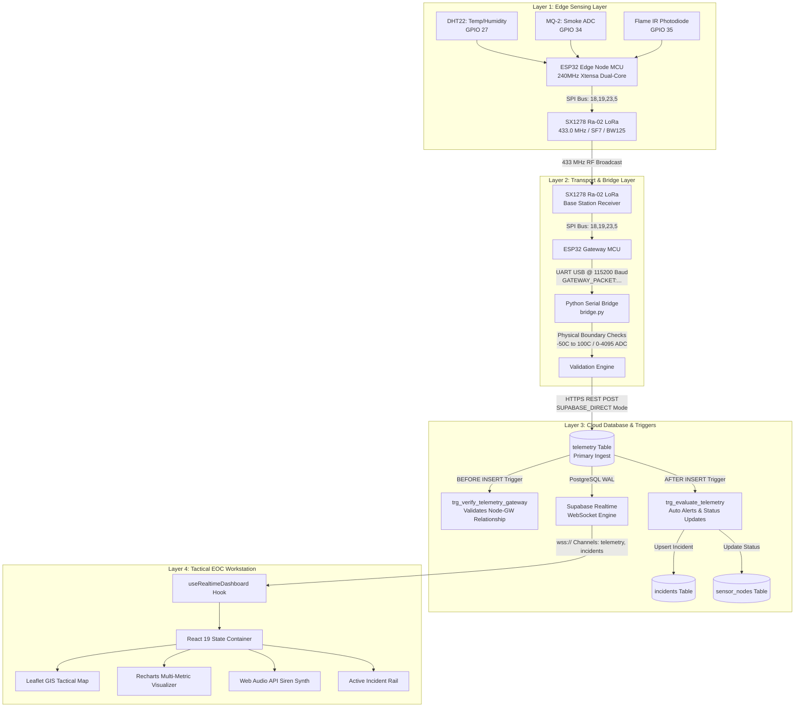
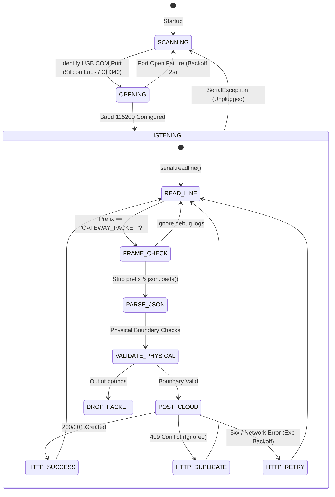
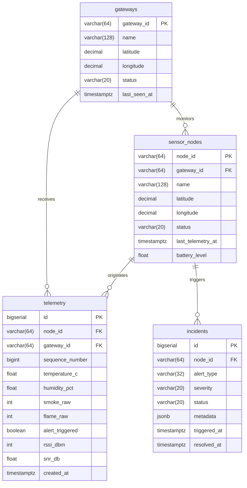

# Technical Documentation & Architecture Manual

## 1. System Architecture Overview

The Wildfire Operations Center (EOC) platform is engineered as a decoupled, multi-tier Edge-to-Cloud telemetry and situational awareness system. It consists of four distinct operational layers:
1. **Edge Sensing Layer:** ESP32 microcontrollers polling physical transducers and modulating RF data.
2. **Sub-GHz RF & Ingestion Layer:** 433 MHz LoRa transceiver base stations coupled with a host-level Python hardware bridge.
3. **Cloud Database & Reactive Rules Engine:** Supabase PostgreSQL 15 instance executing stored procedures, database triggers, and change-data-capture (CDC) streaming.
4. **Presentation & Command Layer:** Next.js 15 single-page tactical operations workstation.



---

## 2. Hardware & Embedded Firmware Architecture

### 2.1 Sensor Node Hardware Blueprint & Electrical Schematic

The edge sensor node operates on an **ESP32 DevKit V1 (30-pin)** board. The system utilizes a dual-voltage rail design ($5.0\text{V}$ for the MQ-2 catalytic heater coil and $3.3\text{V}$ for the ESP32 MCU core, SX1278 LoRa radio, DHT22, and optical flame photodiode).

```
                      +================================================+
                      |         ESP32 DEVKIT V1 (30-PIN MCU)           |
                      |                                                |
[ 5V POWER BANK ] ===>| [VIN (5V)] ───────┬────────────────────────────|───► [MQ-2 VCC (Heater 5V)]
                      | [3.3V OUT] ──┬────┼────────────────────────────|───► [DHT22 VCC (3.3V)]
                      |              │    │                            |───► [Flame IR VCC (3.3V)]
                      |              │    │                            |───► [SX1278 LoRa VCC (3.3V ONLY!)]
                      |              │    │                            |
                      | [GND] ───────┴────┴─── [COMMON GROUND BUS] ────|───► [All Sensor & LoRa GNDs]
                      |                                                |
                      | [GPIO 27] <── (Digital Single-Wire) ──────────|──── [DHT22 DATA]
                      | [GPIO 34] <── (Analog ADC1_CH6) ───────────────|──── [MQ-2 Analog A0]
                      | [GPIO 35] <── (Analog ADC1_CH7) ───────────────|──── [Flame Photodiode A0]
                      |                                                |
                      | [GPIO  5] ─── (SPI NSS / Chip Select) ─────────|───► [SX1278 NSS]
                      | [GPIO 14] ─── (Reset) ─────────────────────────|───► [SX1278 RST]
                      | [GPIO 26] <── (DIO0 / IRQ Interrupt) ──────────|──── [SX1278 DIO0]
                      | [GPIO 18] ─── (VSPI SCK Clock) ────────────────|───► [SX1278 SCK]
                      | [GPIO 19] <── (VSPI MISO Master In) ───────────|──── [SX1278 MISO]
                      | [GPIO 23] ─── (VSPI MOSI Master Out) ──────────|───► [SX1278 MOSI]
                      |                                                |
                      | [ANT PIN] ─────────────────────────────────────|───► [17.3cm 433MHz Antenna]
                      +================================================+
```

### 2.2 Physical 30-Pin ESP32 Pinout Allocation Matrix

```
       LEFT HEADER (Pinout)                     RIGHT HEADER (Pinout)
   +--------------------------+             +--------------------------+
   | EN     - Reset Button    |             | D23    - SX1278 MOSI     |
   | VP     - ADC1_CH0 (Free) |             | D22    - I2C SCL (Free)  |
   | VN     - ADC1_CH3 (Free) |             | TX0    - UART TX (Debug) |
   | D34    - MQ-2 Smoke ADC  |             | RX0    - UART RX (Debug) |
   | D35    - Flame IR ADC    |             | D21    - I2C SDA (Free)  |
   | D32    - Free            |             | D19    - SX1278 MISO     |
   | D33    - Free            |             | D18    - SX1278 SCK      |
   | D25    - Free            |             | D5     - SX1278 NSS (CS) |
   | D26    - SX1278 DIO0 IRQ |             | TX2    - Free            |
   | D27    - DHT22 Data Wire |             | RX2    - Free            |
   | D14    - SX1278 RST      |             | D4     - Free            |
   | D12    - Free            |             | D2     - Built-in LED    |
   | D13    - Free            |             | D15    - Free            |
   | GND    - Common Ground   |             | GND    - Common Ground   |
   | VIN    - 5.0V Power In   |             | 3V3    - 3.3V Rail Out   |
   +--------------------------+             +--------------------------+
```

### 2.3 Sensor Electrical Characteristics & Interfaces

* **DHT22 (AM2302) Temperature & Humidity Sensor:**
  * Power: 3.3V / GND (Current: $\approx 1.5\text{ mA}$ during conversion, $50\,\mu\text{A}$ standby).
  * Signal Pin: **GPIO 27** (Bidirectional single-bus with internal 10k pull-up resistor).
  * Measurement Range: $-40^\circ\text{C}$ to $+80^\circ\text{C}$ ($\pm 0.5^\circ\text{C}$ accuracy), $0\text{--}100\%$ RH ($\pm 2\%$ accuracy).
* **MQ-2 Smoke & Combustible Gas Sensor:**
  * Heater Power: **5.0V** (Direct from power bank / VIN rail), GND.
  * Heater Current Draw: $\approx 150\text{--}180\text{ mA}$ continuous ($350^\circ\text{C}$ internal $\text{SnO}_2$ activation temperature).
  * Analog Output Pin: **GPIO 34** (Connected to ESP32 ADC1 channel 6; input-only pin, high impedance).
  * Measurement: 12-bit SAR ADC ($0\text{--}4095$ range; clean air $\sim 1400\text{--}1700$, dense smoke $> 2000$).
* **Optical Infrared Flame Sensor:**
  * Power: 3.3V / GND (Current: $\approx 15\text{ mA}$).
  * Analog Output Pin: **GPIO 35** (Connected to ESP32 ADC1 channel 7; input-only pin).
  * Sensitivity: 760nm–1100nm infrared spectrum. Inverted analog logic ($4095$ dark ambient IR; drops to $< 100$ on direct open flame detection).
* **Ai-Thinker Ra-02 (Semtech SX1278) LoRa Radio Module:**
  * Power: **3.3V ONLY** (Connecting 5V will permanently destroy the SX1278 chip).
  * Current Draw: $\approx 100\text{--}120\text{ mA}$ during TX (+20 dBm), $12\text{ mA}$ in RX listening mode, $0.2\,\mu\text{A}$ in sleep.
  * SPI Bus: `NSS (GPIO 5)`, `RST (GPIO 14)`, `DIO0 (GPIO 26)`, `SCK (GPIO 18)`, `MISO (GPIO 19)`, `MOSI (GPIO 23)`.
  * Antenna: $17.3\text{ cm}$ quarter-wave monopole wire attached to ANT pin for $433\text{ MHz}$ $50\,\Omega$ impedance matching.

### 2.4 Gateway Base Station Blueprint (`firmware/gateway/gateway.ino`)

The Base Station Gateway runs on a matching ESP32 DevKit V1 paired with an SX1278 LoRa receiver:
1. **SPI Interface:** Identical pinout (`NSS: 5`, `RST: 14`, `DIO0: 26`, `SCK: 18`, `MISO: 19`, `MOSI: 23`).
2. **UART Bridge Output:** Connects via standard Micro-USB to the host machine (Raspberry Pi / field PC) transferring telemetry frames at **115200 baud** with physical RSSI and SNR metadata.

### 2.2 RF Modulation Parameters
* **Carrier Frequency:** `433.0 MHz`
* **Bandwidth (BW):** `125 kHz`
* **Spreading Factor (SF):** `7` (Configured for high data rate and low latency within canopy bounds; expandable up to SF12 for multi-kilometer line of sight).
* **Coding Rate (CR):** `4/5`
* **Sync Word:** `0x12` (Default private network sync word).
* **Preamble Length:** `8 symbols`
* **CRC:** Hardware CRC enabled on all packets.

### 2.3 Edge Packet Formatting
The edge node formats readings into a compact JSON object broadcasted over LoRa:
```json
{
  "node_id": "NODE-DEMO-01",
  "seq": 1024,
  "temp": 28.6,
  "hum": 72.3,
  "smoke": 1781,
  "flame": 4095,
  "alert": false
}
```

### 2.4 Base Station Gateway Firmware (`firmware/gateway/gateway.ino`)
The base station listens continuously for incoming LoRa packets. When a packet passes hardware CRC:
1. It reads the raw RF payload from the SX1278 FIFO buffer.
2. It queries the SX1278 internal registers for Physical Layer metrics:
   * **RSSI (Received Signal Strength Indicator):** Value in dBm (e.g., `-88 dBm`).
   * **SNR (Signal-to-Noise Ratio):** Value in dB (e.g., `+7.5 dB`).
3. It packages the raw JSON string with the physical metrics and outputs a framed string over USB UART at **115200 baud**:
```
GATEWAY_PACKET:{"gw_id":"GW-DEMO-01","rssi":-88,"snr":7.5,"payload":{"node_id":"NODE-DEMO-01","seq":1024,"temp":28.6,"hum":72.3,"smoke":1781,"flame":4095,"alert":false}}
```

---

## 3. Hardware Serial Bridge Architecture (`bridge/bridge.py`)

The bridge is a resilient Python 3 daemon designed to bridge physical UART serial data into cloud web infrastructure.



### 3.1 Validation Engine Boundaries
To prevent garbled memory, cosmic rays, or floating ADC pins from poisoning cloud analytics, `bridge.py` validates every field against hard physical boundaries before transmission:
* Temperature: $-50.0^\circ\text{C} \le T \le +100.0^\circ\text{C}$
* Humidity: $0.0\% \le H \le 100.0\%$
* Smoke ADC: $0 \le \text{ADC} \le 4095$
* Flame ADC: $0 \le \text{ADC} \le 4095$
* RSSI: $-150 \le \text{RSSI} \le 0\text{ dBm}$
* SNR: $-30.0 \le \text{SNR} \le +30.0\text{ dB}$

### 3.2 Ingestion Modes
1. **`SUPABASE_DIRECT` (Default Production Mode):**
   * Transmits directly to `https://<supabase_id>.supabase.co/rest/v1/telemetry`.
   * Authenticates using the Supabase Service Role Key (`apikey` and `Authorization: Bearer` headers).
   * Benefits: Zero intermediary API latency, sub-50ms cloud ingest times.
2. **`API_GATEWAY` Mode:**
   * Transmits to Next.js API route `POST http://localhost:3000/api/telemetry`.
   * Authenticates using a pre-shared bearer token (`TELEMETRY_INGEST_KEY`).

---

## 4. Cloud Database & Backend Stored Procedures (`lib/schema.sql`)

The database is built on PostgreSQL 15 and leverages native relational constraints and PL/pgSQL triggers to handle edge ingestion logic inside the database engine.



### 4.1 Database Trigger Logic

#### A. Gateway-Node Association Trigger (`trg_verify_telemetry_gateway`)
Before any telemetry row is committed, this `BEFORE INSERT` trigger ensures that the `gateway_id` transmitting the telemetry is valid and updates the gateway's `last_seen_at` timestamp.

#### B. Automated Incident Evaluation Trigger (`trg_evaluate_telemetry`)
This `AFTER INSERT` trigger is the core autonomic alert engine:
1. **Status Evaluation:**
   * If `flame_raw < 100` (Infrared flame detected) OR `smoke_raw > 2000` (Dense smoke detected), the node is flagged in emergency condition.
   * If emergency condition is true, `sensor_nodes.status` is updated to `'ALERT'`.
   * If values return to normal ($T < 45^\circ\text{C}$, $\text{Smoke} \le 1500$, $\text{Flame} \ge 1000$), status transitions back to `'ONLINE'`.
2. **Incident Debouncing:**
   * Checks for any existing `'ACTIVE'` incident on the same `node_id`.
   * If no active incident exists, it inserts a new incident record with severity `'CRITICAL'`, capturing the trigger metrics in `metadata`.
   * If an active incident already exists, it avoids duplicate ticketing while updating incident logs.

---

## 5. Tactical EOC Frontend Architecture (Next.js 15 & React 19)

### 5.1 Component Hierarchy

```
app/layout.tsx (Theme Provider, Global CSS)
└── app/page.tsx (Workstation Orchestrator)
    ├── components/Header.tsx (Status Badges, Connection State, Workspace Switcher, Mute Toggle)
    ├── View: 'operations' (Tactical Operations Mode)
    │   ├── components/OperatorMap.tsx (Leaflet GIS Tactical Grid)
    │   │   ├── Dynamic Pulsing Map Markers
    │   │   ├── Coverage Radii Overlays
    │   │   └── Interactive Node Inspection Popups
    │   ├── components/ActiveIncidentsPanel.tsx (Real-time Incident Dispatch Rail)
    │   ├── components/DeviceHealthPanel.tsx (Collapsible Node/Gateway Quick Status)
    │   └── components/FleetHardware.tsx (Hardware Specifications & Quick Commands)
    ├── View: 'telemetry' (Data Analytics Mode)
    │   ├── components/TelemetryCharts.tsx (Recharts Multi-Metric Time Series)
    │   └── components/LiveTelemetryPanel.tsx (Streaming Ingestion Log & CSV/JSON Export)
    └── View: 'system' (Engineering & Diagnostic Mode)
        ├── components/DeviceManagement.tsx (Gateway/Node Registration & Firmware Specs)
        └── components/SchemaViewer.tsx (Live Database Schema & SQL Inspector)
```

### 5.2 Realtime Data Subscription Engine (`lib/hooks/useRealtimeDashboard.ts`)
The application subscribes to Supabase Realtime via WebSockets:
```typescript
const channel = supabase
  .channel('eoc_realtime_stream')
  .on('postgres_changes', { event: 'INSERT', schema: 'public', table: 'telemetry' }, (payload) => {
    handleIncomingTelemetry(payload.new as TelemetryRecord);
  })
  .on('postgres_changes', { event: '*', schema: 'public', table: 'incidents' }, (payload) => {
    handleIncidentUpdate(payload);
  })
  .on('postgres_changes', { event: 'UPDATE', schema: 'public', table: 'sensor_nodes' }, (payload) => {
    handleNodeStatusChange(payload.new as SensorNode);
  })
  .subscribe();
```

### 5.3 Zero-Dependency Browser Audio Synthesizer (`lib/audio.ts`)
Rather than relying on large MP3 audio assets that may fail to load or be blocked by cross-origin policies, the application utilizes the native browser **Web Audio API**:
* Creates an `AudioContext` and dual `OscillatorNode` instances.
* Synthesizes an emergency modulation: primary frequency $880\text{ Hz}$ modulating with an LFO at $440\text{ Hz}$ across square waveforms.
* Controls volume through a `GainNode` and safely shuts down upon operator acknowledgment or mute toggle.
