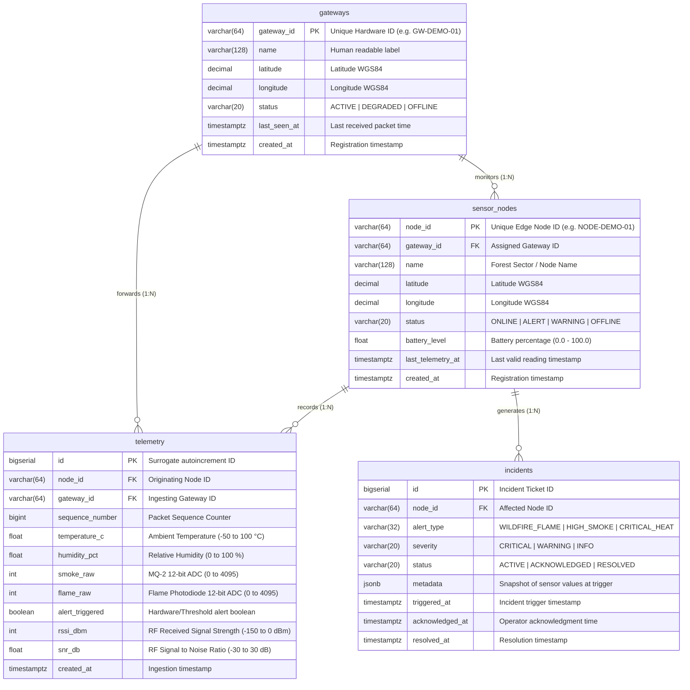

# Database Documentation: PostgreSQL Architecture & Stored Logic

## 1. Overview & Database Technology

The Wildfire Operations Center data persistence tier is hosted on **Supabase (PostgreSQL 15)**. The database acts not merely as a passive storage repository, but as an **active autonomic event processor**, utilizing PL/pgSQL stored procedures, triggers, composite constraints, and Write-Ahead Log (WAL) real-time streaming.

---

## 2. Entity-Relationship Diagram (ERD)



---

## 3. Detailed Table Schema Definitions

### 3.1 Table: `gateways`
Stores registered base station gateway hardware profiles and operational health.

| Column Name | Data Type | Constraints | Default | Description |
| :--- | :--- | :--- | :--- | :--- |
| `gateway_id` | `VARCHAR(64)` | `PRIMARY KEY` | — | Unique hardware gateway identifier. |
| `name` | `VARCHAR(128)` | `NOT NULL` | — | Operator-friendly base station label. |
| `latitude` | `DECIMAL(10, 7)`| `NOT NULL` | — | Physical GPS latitude in decimal degrees. |
| `longitude` | `DECIMAL(10, 7)`| `NOT NULL` | — | Physical GPS longitude in decimal degrees. |
| `status` | `VARCHAR(20)` | `NOT NULL` | `'ACTIVE'` | Current gateway status (`ACTIVE`, `OFFLINE`). |
| `last_seen_at`| `TIMESTAMPTZ` | `NULL` | `NOW()` | Timestamp of last received serial packet. |
| `created_at` | `TIMESTAMPTZ` | `NOT NULL` | `NOW()` | Database record creation timestamp. |

---

### 3.2 Table: `sensor_nodes`
Stores deployed field sensor node configurations, locations, and real-time state.

| Column Name | Data Type | Constraints | Default | Description |
| :--- | :--- | :--- | :--- | :--- |
| `node_id` | `VARCHAR(64)` | `PRIMARY KEY` | — | Unique edge sensor identifier. |
| `gateway_id` | `VARCHAR(64)` | `REFERENCES gateways(gateway_id)` | — | Parent gateway node reporting this sensor. |
| `name` | `VARCHAR(128)` | `NOT NULL` | — | Sector or physical location identifier. |
| `latitude` | `DECIMAL(10, 7)`| `NOT NULL` | — | Fixed GPS latitude in decimal degrees. |
| `longitude` | `DECIMAL(10, 7)`| `NOT NULL` | — | Fixed GPS longitude in decimal degrees. |
| `status` | `VARCHAR(20)` | `NOT NULL` | `'ONLINE'` | Status (`ONLINE`, `ALERT`, `WARNING`, `OFFLINE`). |
| `battery_level`| `REAL` | `CHECK (battery_level BETWEEN 0 AND 100)` | `100.0` | Remaining battery state of charge. |
| `last_telemetry_at`| `TIMESTAMPTZ`| `NULL` | `NOW()` | Timestamp of most recent telemetry insert. |
| `created_at` | `TIMESTAMPTZ` | `NOT NULL` | `NOW()` | Database record creation timestamp. |

---

### 3.3 Table: `telemetry`
High-volume append-only time-series table storing every environmental observation.

| Column Name | Data Type | Constraints | Default | Description |
| :--- | :--- | :--- | :--- | :--- |
| `id` | `BIGSERIAL` | `PRIMARY KEY` | — | Auto-incrementing surrogate row identifier. |
| `node_id` | `VARCHAR(64)` | `REFERENCES sensor_nodes(node_id)` | — | Originating edge sensor node ID. |
| `gateway_id` | `VARCHAR(64)` | `REFERENCES gateways(gateway_id)` | — | Receiving base station gateway ID. |
| `sequence_number`| `BIGINT` | `NOT NULL` | — | Edge firmware packet sequence counter. |
| `temperature_c` | `REAL` | `CHECK (temperature_c BETWEEN -50 AND 100)` | — | Ambient temperature in degrees Celsius. |
| `humidity_pct` | `REAL` | `CHECK (humidity_pct BETWEEN 0 AND 100)` | — | Relative humidity percentage ($0\text{--}100\%$). |
| `smoke_raw` | `INTEGER` | `CHECK (smoke_raw BETWEEN 0 AND 4095)` | — | 12-bit ADC gas/smoke concentration. |
| `flame_raw` | `INTEGER` | `CHECK (flame_raw BETWEEN 0 AND 4095)` | — | 12-bit ADC infrared radiation reading. |
| `alert_triggered`| `BOOLEAN` | `NOT NULL` | `FALSE` | Alert flag calculated at edge/bridge. |
| `rssi_dbm` | `INTEGER` | `CHECK (rssi_dbm BETWEEN -150 AND 0)` | — | Received Signal Strength in dBm. |
| `snr_db` | `REAL` | `CHECK (snr_db BETWEEN -30 AND 30)` | — | Signal-to-Noise Ratio in dB. |
| `created_at` | `TIMESTAMPTZ` | `NOT NULL` | `NOW()` | Ingestion timestamp. |

* **Unique Duplicate Deduplication Constraint:**
  ```sql
  CONSTRAINT uq_node_sequence UNIQUE (node_id, sequence_number)
  ```
  *(Prevents RF packet retransmission storms from creating duplicate records; causes HTTP 409 Conflict handled cleanly by `bridge.py`).*

---

### 3.4 Table: `incidents`
Wildfire emergency ticketing and lifecycle tracking table.

| Column Name | Data Type | Constraints | Default | Description |
| :--- | :--- | :--- | :--- | :--- |
| `id` | `BIGSERIAL` | `PRIMARY KEY` | — | Unique incident ticket number. |
| `node_id` | `VARCHAR(64)` | `REFERENCES sensor_nodes(node_id)` | — | Triggering node identifier. |
| `alert_type` | `VARCHAR(32)` | `NOT NULL` | — | `WILDFIRE_FLAME`, `HIGH_SMOKE`, `CRITICAL_HEAT`. |
| `severity` | `VARCHAR(20)` | `NOT NULL` | `'CRITICAL'` | `CRITICAL`, `WARNING`, `INFO`. |
| `status` | `VARCHAR(20)` | `NOT NULL` | `'ACTIVE'` | `ACTIVE`, `ACKNOWLEDGED`, `RESOLVED`. |
| `metadata` | `JSONB` | `NOT NULL` | `'{}'` | Snapshot of sensor values at trigger instant. |
| `triggered_at` | `TIMESTAMPTZ` | `NOT NULL` | `NOW()` | Exact incident initiation timestamp. |
| `acknowledged_at`| `TIMESTAMPTZ`| `NULL` | — | Timestamp of operator acknowledgment. |
| `resolved_at` | `TIMESTAMPTZ` | `NULL` | — | Timestamp when incident was marked resolved. |

---

## 4. Stored Procedures & Triggers (`PL/pgSQL`)

### 4.1 Gateway Verification Trigger (`fn_verify_telemetry_gateway`)
```sql
CREATE OR REPLACE FUNCTION fn_verify_telemetry_gateway()
RETURNS TRIGGER AS $$
BEGIN
    -- Update gateway last_seen timestamp
    UPDATE gateways
    SET last_seen_at = NOW(), status = 'ACTIVE'
    WHERE gateway_id = NEW.gateway_id;

    -- Update sensor node last_telemetry_at
    UPDATE sensor_nodes
    SET last_telemetry_at = NOW()
    WHERE node_id = NEW.node_id;

    RETURN NEW;
END;
$$ LANGUAGE plpgsql;

CREATE TRIGGER trg_verify_telemetry_gateway
BEFORE INSERT ON telemetry
FOR EACH ROW
EXECUTE FUNCTION fn_verify_telemetry_gateway();
```

---

### 4.2 Autonomic Incident Evaluation Trigger (`fn_evaluate_telemetry_alert`)
```sql
CREATE OR REPLACE FUNCTION fn_evaluate_telemetry_alert()
RETURNS TRIGGER AS $$
DECLARE
    is_fire_detected BOOLEAN := FALSE;
    existing_incident_id BIGINT;
BEGIN
    -- Check physical wildfire condition: Flame IR drops below 100 OR Smoke exceeds 2000 ADC
    IF NEW.flame_raw < 100 OR NEW.smoke_raw > 2000 OR NEW.temperature_c > 55.0 THEN
        is_fire_detected := TRUE;
    END IF;

    IF is_fire_detected THEN
        -- 1. Transition Node Status to ALERT
        UPDATE sensor_nodes
        SET status = 'ALERT'
        WHERE node_id = NEW.node_id;

        -- 2. Check for an already active incident for this node
        SELECT id INTO existing_incident_id
        FROM incidents
        WHERE node_id = NEW.node_id AND status = 'ACTIVE'
        LIMIT 1;

        -- 3. If no active incident exists, create one with JSONB metadata
        IF existing_incident_id IS NULL THEN
            INSERT INTO incidents (node_id, alert_type, severity, status, metadata, triggered_at)
            VALUES (
                NEW.node_id,
                CASE
                    WHEN NEW.flame_raw < 100 THEN 'WILDFIRE_FLAME'
                    WHEN NEW.smoke_raw > 2000 THEN 'HIGH_SMOKE'
                    ELSE 'CRITICAL_HEAT'
                END,
                'CRITICAL',
                'ACTIVE',
                jsonb_build_object(
                    'temperature_c', NEW.temperature_c,
                    'humidity_pct', NEW.humidity_pct,
                    'smoke_raw', NEW.smoke_raw,
                    'flame_raw', NEW.flame_raw,
                    'rssi_dbm', NEW.rssi_dbm,
                    'sequence_number', NEW.sequence_number
                ),
                NOW()
            );
        END IF;
    ELSE
        -- Return node to ONLINE status if readings have normalized
        IF NEW.temperature_c < 45.0 AND NEW.smoke_raw < 1500 AND NEW.flame_raw > 1000 THEN
            UPDATE sensor_nodes
            SET status = 'ONLINE'
            WHERE node_id = NEW.node_id AND status != 'OFFLINE';
        END IF;
    END IF;

    RETURN NEW;
END;
$$ LANGUAGE plpgsql;

CREATE TRIGGER trg_evaluate_telemetry
AFTER INSERT ON telemetry
FOR EACH ROW
EXECUTE FUNCTION fn_evaluate_telemetry_alert();
```

---

## 5. Performance Indexes & Optimizations

```sql
-- Fast historical chart queries filtered by node and time
CREATE INDEX idx_telemetry_node_created ON telemetry (node_id, created_at DESC);

-- Fast duplicate sequence lookup
CREATE INDEX idx_telemetry_node_seq ON telemetry (node_id, sequence_number);

-- Fast active incident lookups for dashboard rail
CREATE INDEX idx_incidents_status ON incidents (status, triggered_at DESC);
```
