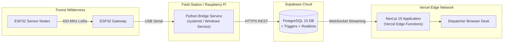

# Deployment Guide: Cloud Infrastructure & Field Gateway

## 1. Production Architecture Overview

The system utilizes a hybrid Edge-Cloud deployment model:
* **Tactical Frontend Workstation:** Hosted on **Vercel** serverless infrastructure (`https://dashboard-mu-azure-bp2m313edn.vercel.app/`).
* **Cloud Database & Streaming Backend:** Hosted on **Supabase Managed Cloud** (AWS us-east-1 / ap-south-1).
* **Field Station Gateway Bridge:** Deployed on an edge host (Linux / Raspberry Pi 4 / Windows Field Laptop) running `bridge.py` as an unattended background service.



---

## 2. Vercel Cloud Frontend Deployment

### 2.1 Connecting the Repository
1. Push your Git repository to GitHub, GitLab, or Bitbucket.
2. Log in to [Vercel](https://vercel.com) and click **Add New Project**.
3. Import your project repository.
4. Select Framework Preset: **Next.js**.
5. Set Root Directory: `./` (Root of repository).

### 2.2 Configuring Production Environment Variables
In the Vercel project configuration page, expand **Environment Variables** and add the following:

| Environment Variable | Value Example | Deployment Target |
| :--- | :--- | :--- |
| `NEXT_PUBLIC_SUPABASE_URL` | `https://your-project-ref.supabase.co` | Production, Preview, Dev |
| `NEXT_PUBLIC_SUPABASE_ANON_KEY` | `eyJhbGciOi...` (Public Anon Key) | Production, Preview, Dev |
| `SUPABASE_SERVICE_ROLE_KEY` | `eyJhbGciOi...` (Secret Service Key) | Production, Preview, Dev |
| `GATEWAY_API_KEY` | `wfc_prod_telemetry_secure_key_9981` | Production, Preview, Dev |

### 2.3 Build & Deploy
Click **Deploy**. Vercel will execute:
```bash
bun run build
# OR: next build
```
Once deployed, verify that the domain (e.g., `https://dashboard-mu-azure-bp2m313edn.vercel.app/`) renders the Tactical Operations Center.

---

## 3. Supabase Cloud Database Configuration

1. In Supabase Dashboard, open **SQL Editor** and run `lib/schema.sql`.
2. Navigate to **Database $\to$ Replication**.
3. Under **Source: supabase_realtime**, ensure the following tables are enabled:
   * `gateways`
   * `sensor_nodes`
   * `telemetry`
   * `incidents`
4. Confirm Row Level Security (RLS) policies allow service-role write operations and public/authenticated read operations.

---

## 4. Raspberry Pi / Field Gateway Bridge Deployment

For long-term, unattended field operations, run `bridge.py` as a Linux `systemd` daemon on a Raspberry Pi connected to the ESP32 Gateway via USB.

### 4.1 Systemd Service Configuration
1. Connect the ESP32 Gateway to the Raspberry Pi USB port.
2. Create the systemd service file:
   ```bash
   sudo nano /etc/systemd/system/wildfire-bridge.service
   ```
3. Paste the following unit definition:
   ```ini
   [Unit]
   Description=Wildfire EOC Hardware LoRa Serial Bridge
   After=network-online.target
   Wants=network-online.target

   [Service]
   Type=simple
   User=pi
   WorkingDirectory=/home/pi/wildfire-eoc/bridge
   ExecStart=/home/pi/wildfire-eoc/bridge/venv/bin/python bridge.py
   Restart=always
   RestartSec=5
   Environment=PYTHONUNBUFFERED=1

   [Install]
   WantedBy=multi-user.target
   ```
4. Enable and start the service:
   ```bash
   sudo systemctl daemon-reload
   sudo systemctl enable wildfire-bridge
   sudo systemctl start wildfire-bridge
   ```
5. Check live service logs:
   ```bash
   journalctl -u wildfire-bridge -f
   ```

---

## 5. Post-Deployment Verification Checklist

- [ ] **Physical Gateway Connection:** ESP32 Gateway USB serial outputs `GATEWAY_PACKET:` strings.
- [ ] **Bridge Transmission:** `bridge.py` logs `[INFO] [SUPABASE] status=201 (Created)`.
- [ ] **Database Persistence:** New rows appear in `telemetry` table within Supabase Table Editor.
- [ ] **Realtime Streaming:** EOC Dashboard top status badge shows `CONNECTED` (Green) and updates data without refreshing.
- [ ] **Acoustic Trigger Test:** Exposing flame sensor to a test flame (or lighter) triggers the pulsing red UI marker and sounds the synthesizer siren within 2 seconds.
- [ ] **Acknowledge & Resolve:** Dispatcher can acknowledge and resolve the incident ticket from the UI.
