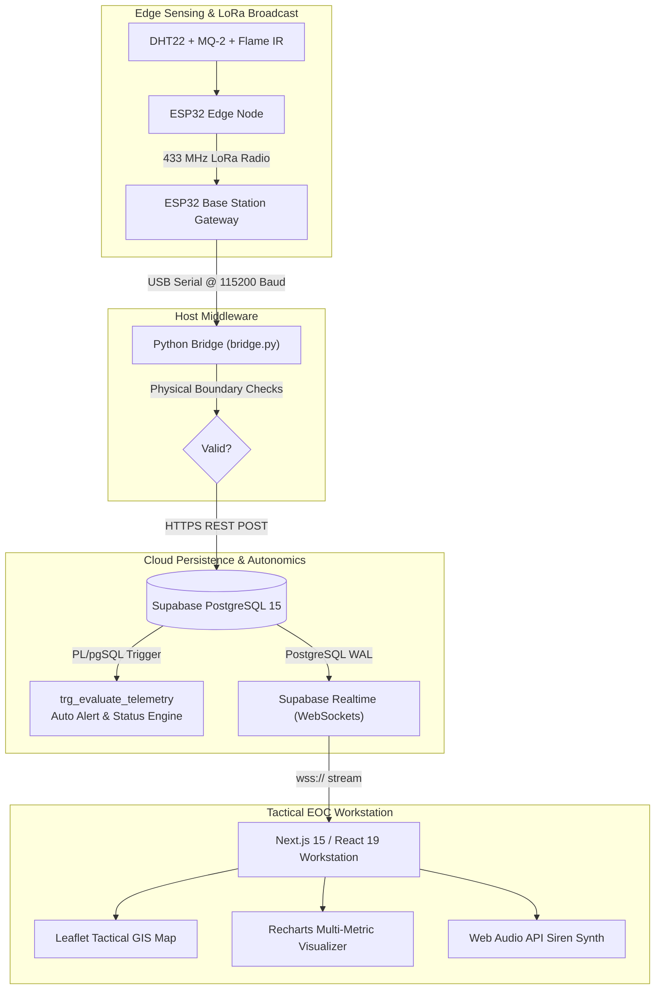

# Wildfire Operations Center (EOC) — Complete Project Handover Package

[](https://nextjs.org/)
[](https://react.dev/)
[](https://supabase.com/)
[](https://espressif.com/)
[](https://opensource.org/licenses/MIT)

> **Handover Recipient:** Final-Year B.Tech Candidate (Computer Science / ECE / IT)  
> **Project Scope:** Edge-to-Cloud IoT Early Wildfire Detection & Tactical Operations Center Platform  
> **Production Deployment:** [https://dashboard-mu-azure-bp2m313edn.vercel.app/](https://dashboard-mu-azure-bp2m313edn.vercel.app/)

---

## 🚀 Quick Start in 3 Minutes

### 1. Run the Web Dashboard
```bash
# Install dependencies
bun install   # or: npm install

# Start local Next.js development server
bun dev       # or: npm run dev
# Open http://localhost:3000
```

### 2. Run the Hardware Serial Bridge (Python)
```bash
cd bridge
pip install -r requirements.txt
python bridge.py
```

### 3. Run Automated Test Suites
```bash
# Run Frontend / API tests (37 passing tests)
bun test

# Run Python Bridge tests (30 passing tests)
python bridge/test_bridge.py
```

---

## 📚 Complete Handover Documentation Structure

| Document Path | Description |
| :--- | :--- |
| **[`01_Project_Overview/Project_Overview.md`](./01_Project_Overview/Project_Overview.html)** | Executive summary, problem definition, objectives, architecture, and scope. |
| **[`02_Technical_Documentation/Technical_Documentation.md`](./02_Technical_Documentation/Technical_Documentation.html)** | Hardware schematics, GPIO pinouts, LoRa RF framing, Python bridge, and triggers. |
| **[`03_User_Manual/User_Manual.md`](./03_User_Manual/User_Manual.html)** | Tactical operations manual, GIS map navigation, incident workflows, and audio alerts. |
| **[`04_Installation/Installation_and_Setup_Guide.md`](./04_Installation/Installation_and_Setup_Guide.html)** | Complete guide to flashing ESP32 firmware, configuring Supabase, and running the bridge. |
| **[`05_Database/Database_Documentation.md`](./05_Database/Database_Documentation.html)** | PostgreSQL 15 schema, ER diagrams, PL/pgSQL stored procedures, and indexes. |
| **[`06_API/API_Documentation.md`](./06_API/API_Documentation.html)** | Full REST API specification with endpoints, request/response bodies, and status codes. |
| **[`07_Deployment/Deployment_Guide.md`](./07_Deployment/Deployment_Guide.html)** | Vercel production deployment, Supabase Realtime setup, and Raspberry Pi daemons. |
| **[`08_Configuration/Configuration_and_Environment_Guide.md`](./08_Configuration/Configuration_and_Environment_Guide.html)** | Reference for all environment variables (`.env.local` and `bridge/.env`). |
| **[`09_Known_Issues/Known_Issues_and_Limitations.md`](./09_Known_Issues/Known_Issues_and_Limitations.html)** | Transparent documentation of system limitations, hardware quirks, and future roadmap. |
| **[`10_Viva/`](./10_Viva/Viva_Questions_and_Answers.html)** | **7 Dedicated Viva & Panel Defense Guides** (Core Q&A, Technical, Architecture, Database, Tech Stack, Security, and 20+ Tough Cross-Examinations). |
| **[`11_Handover/Project_Handover_and_Acceptance.md`](./11_Handover/Project_Handover_and_Acceptance.html)** | Formal deliverables verification matrix and supervisor sign-off sheet. |
| **[`12_Third_Party/Third_Party_Libraries_and_Licenses.md`](./12_Third_Party/Third_Party_Libraries_and_Licenses.html)** | Complete open-source license and third-party dependency directory. |
| **[`Documentation_Index.md`](./Documentation_Index.html)** | Quick-link master navigation index. |

---

## 🛠️ System Architecture at a Glance


